<!-- _paginate: false -->
<!-- _class: lead -->

## __Sustainable Personal Accounts__

:sparkles: Liberate Software Engineers! :sparkles:
Each of them deserves a full AWS account to innovate fastly.

---

## Sustainable Personal Accounts

__What?__ Provide an entire AWS account to every cloud practitioner of your enterprise. Yes, this can mean 1,000s of AWS accounts.

__Why?__ Because collective business agility depends on capability to build on cloud infrastructure. Access to AWS console, SDK and API is differentiating your business.

__How?__ Automate the management of AWS personal accounts at scale, including maintenance window to purge resources, to enforce corporate guardrails and to update shared blueprints. This is an open source package to be deployed within AWS Control Tower.

---
## __Sustainable Personal Accounts__
1. Guiding Principles
2. State Machine
3. Event-driven Architecture
4. How to adapt the solution to your specific requirements?
5. Initial Release Plan

---
## Guiding Principles

<!--
What is making this project different?

Let us explain the mental models that explain our terms of reference, and related Key Performance Indicators.
-->

__We drive innovation with experimentations__ - A KPI is the number of AWS accounts assigned to individuals across the corporation.

__We trust our employees and colleagues__ - A KPI is the fraction of cloud accounts that go above budget and need corrective action.

__We influence corporate culture with recycling__ - Maintenance windows enforce resource deletion (cost avoidance) and foster Continuous Integration (CI) at enterprise scale.

__We scale with automated guardrails and with insourced blueprints__

---

## State Machine

__Vanilla Accounts__ when they have just been created

<!--
The recommended way to create accounts is to use the factory created by AWS Control Tower in AWS Service Catalog. You can also integrate an existing AWS account but this is adding a lot of manual work and should be avoided.
-->

__Assigned Accounts__ need guardrails and blueprints

<!--
When accounts have been assigned, they need to be prepared according to corporate policies and to automation practice. Security team will provide guardrails, such as IAM roles that can be used in corporate SIEM. DevOps team may provide a set of tools useful to developers, including automated CI/CD backend.
-->

__Released Accounts__ are available to individuals

<!--
Accounts are released once they have been duly prepared. This is the period in time where software engineers can leverage their personal account and achieve maximum innovation speed.
-->

__Expired Accounts__ need purge of resources

<!--
Maintenance window can very from one day to several months, depending of your corporate policy. On expiration, accounts are purged from existing and then considered as vanilla accounts again.
-->

---
## Event-driven Architecture

* __Organisational Units (OU) store states of the machine__ and enforce scoped limitations with Service Control Policies (SCP).

* __Single event bus__ for OU transitions and for events generated by SPA itself. EventBridge bus lives in Automation account.

* __Serverless processing of transitions with Lambda functions__ deployed in Automation account, and triggered with EventBridge.

* __Serverless heavy processing with CodeBuild projects__ executed within each personal account, on maintenance windows.

<!--
Heavy processing include: the update of guardrails, the update of corporate blueprints, and the purge of cloud resources.
-->

---
## <!--fit--> How to adapt the solution to your specific requirements?

__1. Serverless customization with SSM Parameter Store:__ Add script shell commands of your choice to CodeBuild projects.

__2. Fork this open source project:__ If you have python competencies with AWS CDK and boto3, then feel free to fork this project and to taylor it to your specific needs.

__3. Reply can help!__ We are using the system for ourselves. And we have developed it, before sharing it with the community. 

---
## Initial Release Plan

🟢 🚩 Get idea validation from AWS Control Tower specialists (Dec)

🟢 Develop the solution for internal needs of Storm Reply

🟢 Seek continuous support from AWS Control Tower specialists

▪️ Release of public GitHub repository of SPA (March)

▪️ Release of technical blog post on the SPA design (March)

▪️ Presentation to AWS Summit in Paris (April) 🏁

---
<!-- _class: lead -->

# Thank you!

https://github.com/reply-fr/sustainable-personal-accounts

---
<!-- _paginate: false -->
<!-- _class: lead -->

