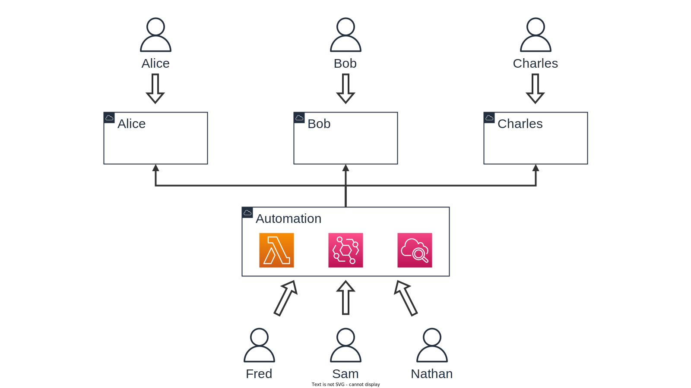
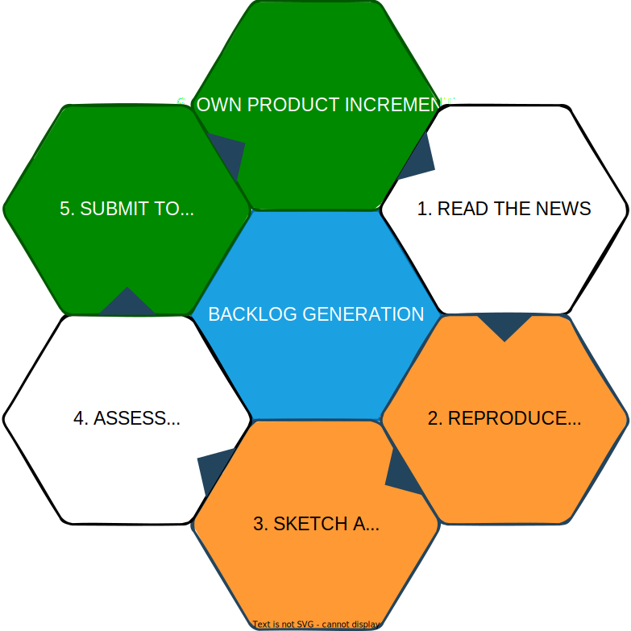
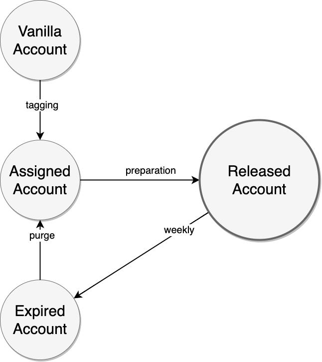
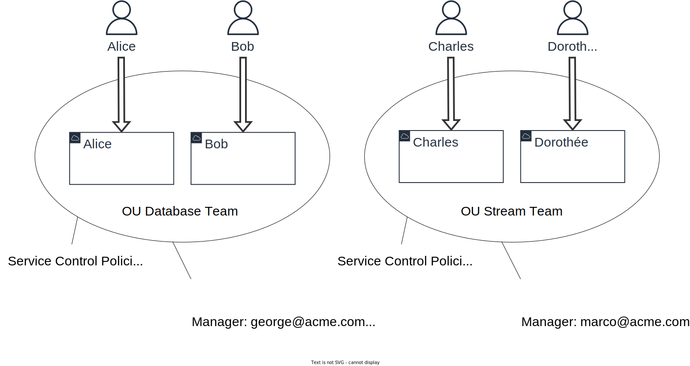
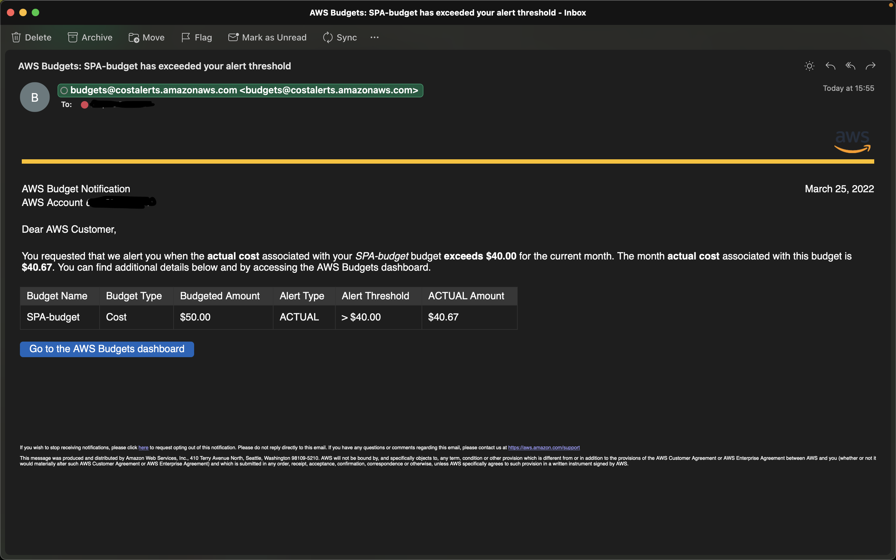
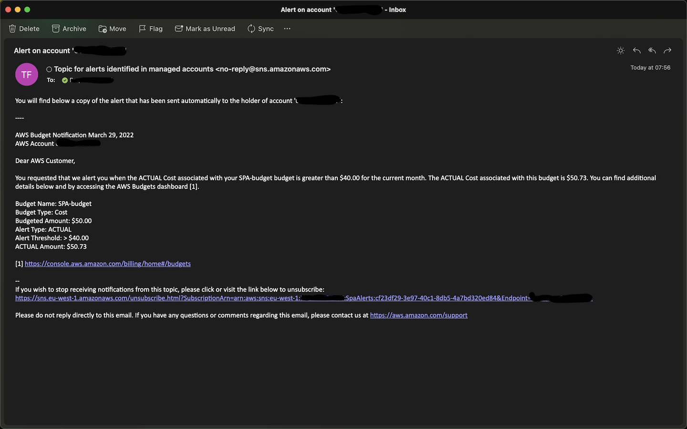

<!-- _paginate: false -->
<!-- _class: lead -->

## __Sustainable Personal Accounts__

:sparkles: Liberate Software Engineers! :sparkles:
Each of them deserves a full AWS account to innovate fastly.

---
<!-- _class: lead -->
## __“ Knowledge technologists become the dominant social force ”__
### -- Peter Drucker (2001)

# :recycle:

## __“ The condition of all progress is experience ”__
### -- Felix Adler (1913)

---
<!-- _paginate: false -->

## <!-- fit -->Experiment, then innovate

👷 As an innovative employee,
I want to test emerging technology breakthroughs and stick at competitive edge.

🧪 Please help me to sketch ideas on cloud platform before contributing to our software and data products.

---

## :sparkles: Sustainable Personal Accounts

__What?__ SPA provides an entire AWS account to software engineers of an enterprise. Yes, this can mean thousands of AWS accounts to manage.

__Why?__ Collective business agility relies on individuals. Democratize access to AWS console and tools to accelerate innovation.

__How?__ SPA automates the management of AWS personal accounts at scale, with maintenance windows on each account. Central teams can purge resources, enforce corporate guardrails and update shared blueprints periodically and automatically.

---

## :telescope: Use Sustainable Personal Accounts to:

- align newly created AWS account with corporate policies
- configure AWS Budgets, and consolidate budget alerts
- continuously deploy the DevOps and SIEM tools of your enterprise
- force the purge of cloud resources at regular points in time
- tag AWS accounts as per FinOps and CloudOps changing needs
- manage AWS accounts collectively (by Organization Unit) or individually
- set maintenance window of your choice
- adjust CodeBuild scripts to your exact needs

---
## :rainbow: Guiding Principles

<!--
What is making this project different?

Let us explain the mental models that explain our terms of reference, and related Key Performance Indicators.
-->

__We drive innovation with experimentations__ - How many AWS accounts are for individuals across your organization? #KPI

__We trust our employees and colleagues__ - Few cloud accounts go above budget and need corrective action. #KPI

__We influence corporate culture with recycling__ - Maintenance windows enforce resource deletion (cost avoidance) and foster Continuous Integration (CI) at enterprise scale.

__We scale with automated guardrails and with insourced blueprints__

---

## State Machine

__Vanilla Accounts__, when they have just been created

<!--
The recommended way to create accounts is to use the factory created by AWS Control Tower in AWS Service Catalog. You can also integrate an existing AWS account but this is adding a lot of manual work and should be avoided.
-->

__Assigned Accounts__ need guardrails and blueprints

<!--
When accounts have been assigned, they need to be prepared according to corporate policies and to automation practice. Security team will provide guardrails, such as IAM roles that can be used in corporate SIEM. DevOps team may provide a set of tools useful to developers, including automated CI/CD backend.
-->

__Released Accounts__ are available to individuals

<!--
Accounts are released once they have been duly prepared. This is the period in time where software engineers can leverage their personal account and achieve maximum innovation speed.
-->

__Expired Accounts__ need purge of resources

<!--
Maintenance window can very from one day to several months, depending of your corporate policy. On expiration, accounts are purged from existing and then considered as vanilla accounts again.
-->

---
## :factory: Event-driven Architecture

* __Account tags store states of the machine__ and enforce scoped limitations with Service Control Policies (SCP).

* __Single event bus__ for state transitions and for events generated by SPA itself. EventBridge bus lives in Automation account.

* __Serverless processing of transitions with Lambda functions__ deployed in Automation account, and triggered with EventBridge.

* __Serverless heavy processing with CodeBuild projects__ executed within each personal account, on maintenance windows.

<!--
Heavy processing include: the update of guardrails, the update of corporate blueprints, and the purge of cloud resources.
-->

---
<!-- _paginate: false -->

---
<!-- _class: lead -->

# Settings per Organizational Unit

---
<!-- _class: lead -->
<!-- _paginate: false -->

## Ok, walk me through the solution

---
<!-- _paginate: false -->

---
<!-- _paginate: false -->

---
<!-- _paginate: false -->

---
## :clapper: Initiative timeline

🥚 Validate the concept with AWS Control Tower specialists (Dec 2021)

🐣 Introduce SPA at AWS Summit in Paris (April 2022)

🐤 Release of public GitHub repository of SPA (Summer 2022)

🐥 Adapt the solution to multiple enterprises

🐦 Present SPA governance capabilities at AWS Summit in Paris (April 2023)

🐧 Release of technical blog post on the SPA design (H2)

---
## <!--fit--> :beers: How to adapt the solution to your specific requirements?

__1. Customization with configuration and templates:__ Download the package, look at the documentation and run it for yourself.

__2. Fork this open source project:__ If you have python competencies with AWS CDK and boto3, then feel free to fork this project and to taylor it to your specific needs.

__3. Reply can help!__ We are using the system for ourselves. And we have developed it, before sharing it with the community.

---
<!-- _class: lead -->

https://github.com/reply-fr/sustainable-personal-accounts

---
<!-- _paginate: false -->
<!-- _class: lead -->

