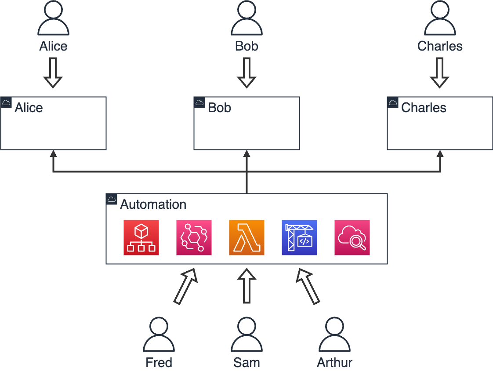
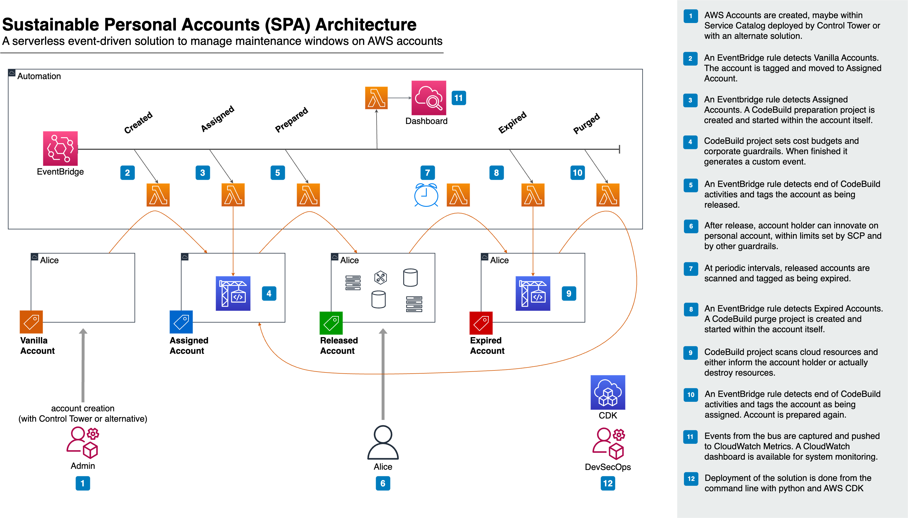
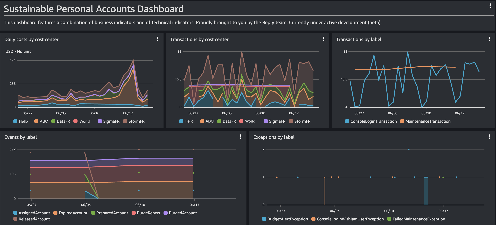
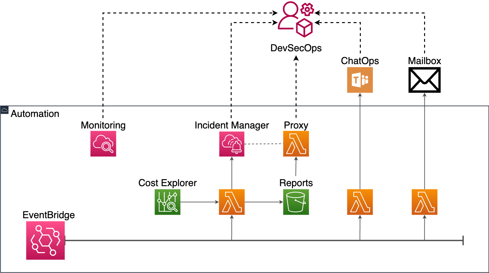
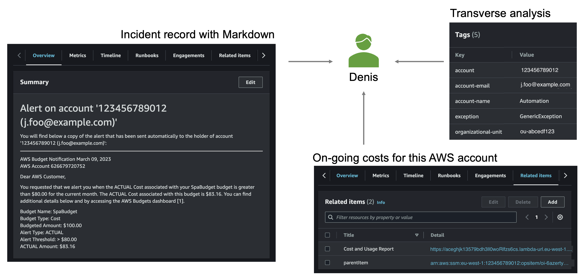
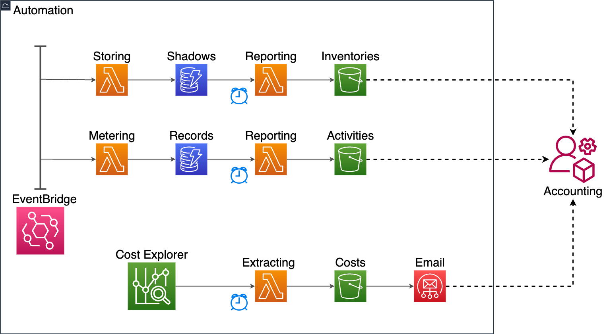
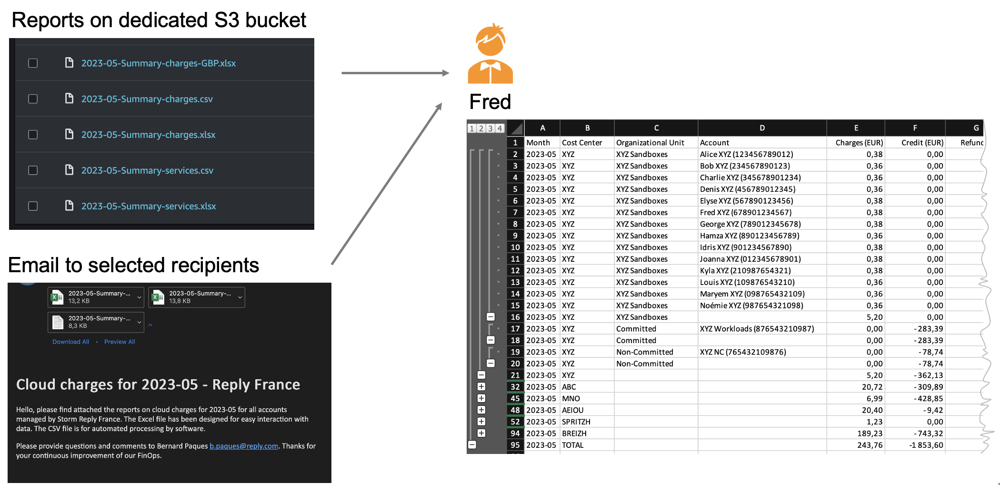
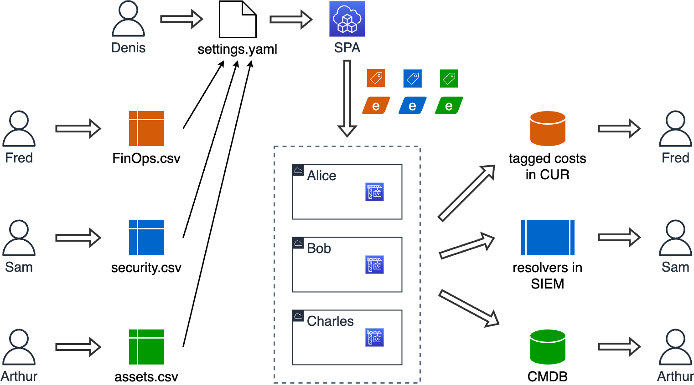

# Sustainable Personal Accounts

## Sustainable Personal Accounts (SPA) automates AWS accounts assigned permanently to employees

With Sustainable Personal Accounts (SPA) you can control, purge and manage AWS accounts assigned permanently to employees of your enterprise.

As a CTO/CCoE Leader/R&D Director:

- I recognize that innovative companies distribute sandbox AWS accounts to their staff
- I provide AWS accounts to cloud practitioners of my enterprise
- I manage these corporate resources at scale with SPA

As a person who benefits from a personal AWS account:

- After authentication, I connect to my account with `AWSAdministratorAccess` permission,
- A budget is set automatically to alert me by email,
- CodeBuild projects are executed on my behalf for purging cloud resources and for alignment with corporate policies.

As a DevOps in charge of SPA deployment:

- I drive the behavior of SPA from a single YAML file with all settings,
- I can adjust the Codebuild project used for account preparation to evolving corporate policies
- I can adjust the Codebuild project used for account purge to evolving corporate policies
- I can select when maintenance transactions are triggered,
- I can define settings for each organizational unit for easy scaling
- I can define settings for individual accounts for fine-grained tuning
- I can integrate tags from CSV files communicated by other teams (e.g., FinOps, Security, Enterprise Architecture)

As a SRE in charge of SPA operations:

- I can manage preventive controls on personal accounts with SCP
- An automated CloudWatch dashboard covers technical and functional monitoring in one place
- SPA activities, aka, console logins, account on-boarding, account maintenance, are reported as CSV files in S3 bucket every month
- FinOps reports are produced every month as CSV and Excel files in S3 bucket
- Management exceptions are managed interactively in Incident Manager
- Instant cost report is attached to incident records for contextual analysis
- Inventories of accounts are produced as CSV files in S3 bucket every week

As a FinOps engineer:

- I receive cost reports every month in my mailbox
- The Excel report consolidates costs per cost center and per organizational unit for easy analysis
- The CSV report is processed with custom software for automated show-back and charge-back

## SPA has been designed for AWS Organizations

Mandatory requirements:

- SPA is leveraging AWS Organization for events management and for account management across AWS accounts. The deployment of AWS Organizations can be managed by Amazon Control Tower, but Amazon Control Tower itself is not mandatory.
- SPA should be deployed on a dedicated AWS account. This facilitates the management of permissions accross a large number of AWS accounts, and contributes to the separation of concerns.
- SPA needs an assume role with permissions on the AWS Organization
- SPA needs an assume role with permissions within each AWS account that it manages

We recommend to deploy Amazon Control Tower and to benefit from cloud automation at scale on top of AWS Organizations, of AWS Service Catalog and of AWS IAM Identity Center (successor to AWS SSO). However, this is not a requirement for SPA, and you can deploy and use the solution without Amazon Control Tower.

## Get started with Sustainable Personal Accounts

A set of workbooks are available for common operations on Sustainable Personal Accounts, such as:

- [Full Setup of SPA](./workbooks/full-setup-of-spa.md) - Start here for initial installation
- [Manage preparation tasks](./workbooks/manage-preparation-tasks.md) - Customize the preparation of accounts
- [Inspect a SPA system](./workbooks/inspect-a-production-system.md) - Review the behavior of SPA components
- [Manage preventive controls](./workbooks/manage-preventive-controls.md) - Define guardrails for personal accounts
- [Create a personal account](./workbooks/create-a-personal-account.md) - Add manually an account handled by SPA
- [Add Microsoft Teams webhook](./workbooks/add-microsoft-teams-webhook.md) - Forward SPA notifications to ChatOps channels
- [Transmit reports over email](./workbooks/transmit-reports-over-email.md) - Forward SPA reports to selected email recipients
- [Manage account states](./workbooks/manage-account-states.md) - Handle account tags by yourself
- [Release all managed accounts](./workbooks/release-managed-accounts.md) - Set all state machines to RELEASED state
- [Reset all managed accounts](./workbooks/reset-managed-accounts.md) - Set all state machines to VANILLA state
- [Manage account costs](./workbooks/manage-account-costs.md) - Automate some FinOps activities with SPA
- [Setup continuous deployment of SPA](./workbooks/setup-continuous-deployment.md) - Use GitOps principles to operate SPA

## Sustainable Personal Accounts features an event-driven serverless architecture

Persistence of states is done with tags set on AWS accounts. State transitions are handled with Eventbridge, Lambda, CodeBuild and DynamoDB. The management of the solution is done with CloudWatch, SSM Incident Manager, Cost Explorer and S3 reporting bucket.

Sustainable Personal Accounts has been designed with following principles:

- the entire solution is configured with one single YAML file
- the entire infrastructure is deployed with python code and AWS CDK
- the configuration of organizational units and accounts is store in SSM Parameter Store
- states of the state machine are implemented with tags on AWS accounts -- no database for state management
- computing resources are entirely serverless, powered by Lambda functions and CodeBuild projects
- processing is driven by events, powered by AWS EventBridge
- budget alerts are consolidated over SQS
- data persistence is provided with DynamoDB tables
- the preparation of an AWS account is done with a customizable Codebuild project -- adapt it to your corporate policy
- the purge of an AWS account is done with a customisable Codebuild project -- adapt it to your FinOps best practices
- monitoring is implemented with a CloudWatch dashboard deployed automatically
- system can be extended to specific needs via custom event processing

## Sustainable Personal Accounts provides an integrated monitoring dashboard

The monitoring dashboard provides a combination of business indicators and of technical indicators:

- daily costs per cost center
- daily transactions per cost center
- daily transactions per label
- events by label
- exceptions by label
- invocations of Lambda functions
- durations of Lambda executions
- Lambda errors
- read units for DynamoDB tables
- write units for DynamoDB tables
- errors with DynamoDB tables

## Sustainable Personal Accounts interacts with human beings on exceptions

Sustainable Personal Accounts provides a monitoring dashboard that can be checked when you want. But you do not need to keep your eyes on the monitoring dashboard. On an exceptional situation, SPA can post a message in a Microsoft Teams channel. It can also send you an alert over e-mail. You can come back anytime to SSM Incident Manager, where SPA will push incident records with tags and with contextualised cost reports.

## Sustainable Personal Accounts integrates ticket management

When an exceptional situation is encountered, Sustainable Personal Accounts creates an incident record in SSM Incident Manager. Examples of exceptions:

- budget alert
- console login with IAM User or with root credentials
- failed maintenance transaction

On exception, SPA queries cost explorer and produces a report for on-going costs. The report is attached to the incident record for easy access. Also, each incident record is tagged so that you can use information items for problem management, or for transverse analysis of past incident records.

## Sustainable Personal Accounts automates reporting

Sustainable Personal Accounts produces following kinds of reports:

- costs - These reports in CSV and in Excel formats are produced for managers of the service, and for managers of cost centers.

- activities such as on-boarding, maintenance and console login - These reports in CSV format are provided to feed a downward system such as a database. They can be used for service analytics.

- inventories of accounts - These reports in CSV format mention cost centers, Organizational Units, dates of last login, and account state. They can be used to detect unused accounts, and accounts that have not be released for some reason.

Reports are put on a S3 bucket for easy storage. Summary reports can also be transmitted over email to selected recipients, for example to the FinOps mailbox.

## Sustainable Personal Accounts contributes to FinOps

FinOps teams can get cost details per cost centers and per Organizational Units. Each AWS account is tagged with one cost center, and is placed in one Organizational Unit. This structure has proven very convenient, since it leverages the structure put in AWS Organisations itself.

## Sustainable Personal Accounts is driven by configuration files

Sustainable Personal Accounts is provisioned and configured from a single YAML file. Settings cover every aspect of the solution, for example the cron expression that triggers the maintenance window, the buildspec files for CodeBuild tasks on accounts.

In addition, part of the solution configuration can be delegated to CSV files. This architecture allows extended contributions to the settings of SPA

## Any other question?

Please check the [Frequent Asked Questions page](./FAQ.md), maybe your point has already been addressed there.
