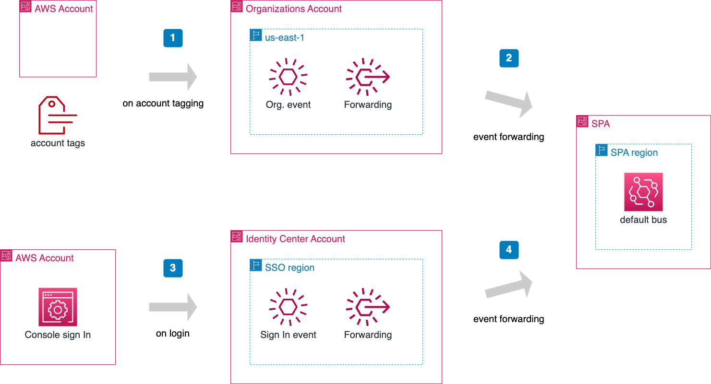

# Inspect EventBridge

## Overview

SPA relies on EventBridge for the emission, transmission and routing of events; Some events are generated by the AWS platform itself. Other events are generated by SPA itself. In this workbook we explain how to inspect and to troubleshoot situations where events are not flowing correctly.

- [Understand EventBridge](#overview)
- [Inspect EventBridge metrics](#step-1)
- [Inspect EventBridge errors](#step-2)
- [Inspect events on account tagging](#step-3)
- [Inspect events on console login](#step-4)

## Prerequisites

- You have credentials to access the AWS Console
- You have received permissions to manage the AWS Organization where SPA has been deployed
- You have received permissions to access the AWS account where SPA has been deployed

## Understand the components of the architecture 

## Step 1. Inspect EventBridge metrics 

## Step 2. Inspect EventBridge errors 

Use this validation workflow to isolate the problem:

1. Confirm that the relevant event occurred. For this you can look at the CloudTrail log from the originating AWS account and AWS region. The originating region for AWS organization events is always North Virginia, aka, `us-east-1`. The originating region for console login events is the region where you deployed AWS IAM Identity Center (previously known as SSO) .

2. Confirm that the event matched the rule event pattern. For this you can inspect carefully the sample event found in CloudTrail with the pattern set in the event rule. Start with simple matching by removing attributes to the event until the rules triggers as expected. Then you can add additional matching attributes and narrow the triggering.

3. Confirm that the target successfully processed the event. In the case of SPA, the target is either a Lambda function or a forwarding to where SPA has been deployed. For Lambda functions you will at the CloudWatch logs of SPA in the region where SPA has been deployed.

Sometimes EventBridge reports on failed invocations, but does not report on that in logs. This is because the EventBridge run-time relies on the downwards resources for logging. For example, if an event is passed to Lambda, then you are supposed to look for errors in the Lambda logs. If you do not find a log in the resource, then the failure may have happened between EventBridge and the target resource. This can be analyzed with the introduction of a Dead-Letter Queue (DLQ). Messages put in the DLQ by EventBridge do provide messages that are useful for troubleshooting.

Learn more:

- Amazon EventBridge: [Event retry policy and using dead-letter queues](https://docs.aws.amazon.com/eventbridge/latest/userguide/eb-rule-dlq.html)
- [Debug failed invocations for AWS EventBridge rules](https://medium.com/@mr.mornesnyman/debug-failed-invocations-for-aws-eventbridge-rules-27689ec4fe09)

## Step 3. Inspect events on account tagging 

## Step 4. Inspect events on console login 

## Follow-up

