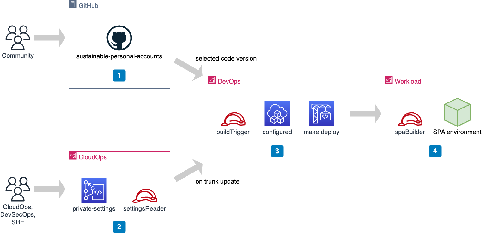

# Setup Continuous Deployment

## Overview

With this workbook you can automate with GitOps the update of a SPA deployment. This suits the requirements of corporate environments where a team is responsible collectively of a cloud workload, and where the team acts on this environment via collaboration on a git repository.

1. [Understand continuous deployment with GitOps](#step-1)
2. [Segregate roles and responsibilities](#step-2)
3. [Deploy a private repository for CloudOps team](#step-3)
4. [Deploy a role on the target AWS account](#step-4)
5. [Deploy software automation on account `DevOps`](#step-5)
6. [Hook the pipeline into the private repository](#step-6)
7. [Validate the system end-to-end](#step-7)

## Prerequisites

- You have an AWS account `Automation` to deploy SPA
- You have an AWS account `CloudOps` to manage settings of your SPA environment
- You have an AWS account `DevOps` for the automation of the deployment
- You have credentials to access the AWS Console
- You have permissions to deploy resources on each AWS account mentioned above

## Step 1: Understand continuous deployment with GitOps <a id="step-1"></a>

Here we put in place a [GitOps](https://about.gitlab.com/topics/gitops/) approach for the build and for the update of a SPA environment. GitOps requires Infrastructure-as-Code, change management rooted in git, and software automation.

Our GitOps implementation for SPA has specific flavor:

- **Infrastructure-as-Code** - SPA features multiple Lambda functions, DynamoDB tables, a CloudWatch dashboard, one SSM Incident Manager response plan, etc. The code base leverages the Python language, including Infrastructure-as-Code with the AWS Cloud Development Kit (CDK). A convenient command `make deploy` is provided that deploys a ready-to-use SPA environment.

- **Change management rooted in git** - The deployment of SPA requires a public code base and private settings. Our focus here is on change management of private settings. This is implemented with a private CodeCommit repository and with pull requests managed collectively by the CloudOps team. A merge on the main branch triggers an update of the target SPA environment.

- **Explicit versioning of SPA** - You can stick to one specific version of SPA by mentioning which tag you use, e.g., `v23.8.3` or which git commit hash. You keep SPA versions under control, and you upgrade when you want. If you use only the name of a branch, say, `main` then you will get the very last version of code on each deployment. This can break your production system, and it is not recommended. To stay on the safe side of the business, please go for explicit versioning of your deployed SPA.

- **Automated deployment** - The build and update of a SPA environment is a linear sequence of shell commands. We put the software pipeline on a separate AWS account so that it cannot be confused with manual configuration. Hands-off, cloud engineers! A CodeBuild project provides a serverless and headless shell for all the commands we need. CloudFormation manages changes out of templates generated by CDK. SPA is purely based on Lambda functions, and the CloudFormation stack has full control on code that is deployed.

In addition, our GitOps implementation spans multiple AWS accounts and is deliberately embracing serverless products from AWS. The following diagram represents the overall GitOps architecture put in place for the SPA use case.



1. The code base of SPA is open source, and made available from GitHub. You do not want to update your SPA production environment on every update of this code base. Instead, you want to set explicitly which tag or commit you are using.

2. The exact configuration of your SPA environment is maintained as a private git repository on CodeCommit. Here the CloudOps team can set settings files and CSV files, describe the target configurations of Organizational Units, list AWS accounts and their configurations. They can also provide customized `buildspec` files and shell scripts for the preparation or for the purge of accounts, or both. Changes are managed with pull requests on branches contributed by team members. [CodeCommit supports pull requests](https://docs.aws.amazon.com/codecommit/latest/userguide/pull-requests.html) from the CodeCommit console, from the AWS CLI and from AWS SDKs. Each update of the trunk branch induces an update of the SPA environment. Private content is exposed to the account `DevOps` via a specific IAM role.

3. When an update is triggered, a CodeBuild project is executed in a separate account, named `DevOps`. This fetches the SPA code base from GitHub and the private settings from CodeCommit. This also combines the two set of files and runs non-regression tests. Then it builds or updates the target SPA environment.

4. Since it has a serverless architecture, the target SPA environment is built or updated one component at a time. The capability to act on this environment is granted to the account `DevOps` via a specific IAM role.

Now that we have a global picture of GitOps for SPA, let focus on the automation itself, that is implemented with a CodeBuild project in the account `DevOps`.

## Step 2: Segregate roles and responsibilities <a id="step-2"></a>

The continuous deployment architecture is split across multiple AWS accounts, and this allows us to control the permissions that are given to each software entity involved in the process. The CodeBuild project has no specific super-power by itself. Instead, code executed in the pipeline gets explicit permissions by assuming roles from source and from target AWS accounts.

More specifically, when the CodeBuild project is triggered on account `DevOps`, the following activities are performed successively:

1. **Assume role from account `CloudOps` and fetch configuration from CodeCommit repository** - IAM permissions are handled with AWS CLI commands and local environment variables. The command `aws sts assume-role` gets a temporary token from the account CloudOps. This is turned to an IAM authentication context for the `git-remote-commit` package. Configuration files are fetched with command `git clone` performed over HTTPS (GRC) protocol. Some configuration file defines which version of the SPA code base has to be fetched from GitHub.

2. **Fetch code from GitHub** - This is implemented with command `git clone` command. The command `make setup` is executed to download and install software dependencies. CodeBuild provides about 220 GiB of storage, so there is plenty of room for significant code base and dependencies. The private configuration files from CodeCommit are copied onto the original code base from GitHub.

3. **Test the code locally** - This is implemented with commands `make lint` and `make all-tests`. If one of these commands fails, then the process does not go further.

4. **Assume role from account `Automation` and apply changes there** - IAM permissions are handled again with AWS CLI commands and local environment variables. The command `aws sts assume-role` gets a temporary token from the account `Automation`. This is turned to an IAM authentication context to the next shell command: `make deploy`. This creates or updates the target SPA environment.

You have probably noticed how complex stuff is encapsulated in `make` commands. You can read the blog post [Makefile is my buddy](https://bernard357.hashnode.dev/makefile-is-my-buddy) for more details. This encapsulation delineates the hooks invoked in the CodeBuild project, e.g., `make xxx`, from actual shell commands, that are put in the `Makefile`.  In other terms, the `Makefile` is playing here a role equivalent to a `Jenkinsfile` or `.gitlab-ci.yml` in other contexts. Software engineers can tune the `Makefile` to adjust the exact behavior of Continuous Deployment (CD).

## Step 3: Deploy a private repository for CloudOps team <a id="step-3"></a>

We get a clear picture of what has to be built, so it is time to make it real, starting with private settings of SPA.

### Store private settings in CodeCommit

First, we create a CodeCommit repository for collaborative work on system configurations:

- Login to the AWS Console of the account `CloudOps`
- Go to the CodeCommit console in the selected region
- Click on `Create repository`
- Give it a name, e.g., `SpaSettings` and a description

Copy the HTTPS (GRC) reference of the new repository, this is what you will put in CodeBuild project in variable `SETTINGS_GIT_URL`. The string can be obtained from `Clone URL` then `Clone HTTPS (GRC)`. It is similar to the following:

`codecommit::eu-west-1://SpaSettings`

### Give CodeBuild the permission to read private settings

Then we create an IAM role in account `CloudOps` that can be assumed by CodeBuild running in account `DevOps`:

- Login to the AWS Console of the account `CloudOps`
- Go to the IAM console
- In the left panel, click on Roles
- Click on button `Create role`
- For the trusted entity, select AWS account and enter the 12-digit identifier of the account `DevOps`.
- Click on `Next`
- Search among the managed permission policies for `AWSCodeCommitReadOnly`
- Click on `Next`
- Provide a name, e.g., `Spa-ReadSettingsRole`
- Provide a description, e.g., `Allow cross-account access to SPA private settings`
- Click on `Create role`

Note the ARN of the new role, since we will refer to it in CodeBuild project as variable `SETTINGS_ROLE`.

## Step 4: Deploy a role on the target AWS account <a id="step-4"></a>

Here we create an IAM role in account `Automation` that can be assumed by CodeBuild running in account `DevOps`:

- Login to the AWS Console of the account `Automation`
- Go to the IAM console
- In the left panel, click on Roles
- Click on button `Create role`
- For the trusted entity, select AWS account and enter the 12-digit identifier of the account `DevOps`.
- Click on `Next`
- Search among the managed permission policies for `AdministratorAccess` - or select your own policy if you wish
- Click on `Next`
- Provide a name, e.g., `Spa-DeployEnvironmentRole`
- Provide a description, e.g., `Allow the deployment of an SPA environment`
- Click on `Create role`

Note the ARN of the new role, since you will refer to it in CodeBuild project as variable `DEPLOY_ENVIRONMENT_ROLE`.

## Step 5: Deploy software automation on DevOps account <a id="step-5"></a>

Software automation is implemented with one single CodeBuild project and multiple triggers. In this setup, the `buildspec` does not come from the source code. We provide explicit content instead. from the AWS console, we create a basic CodeBuild project, then we iterate on it to finalize the setup.

### Create a basic CodeBuild project

We start with a basic CodeBuild project:

- Login to the AWS Console of the account `DevOps`
- Go to the CodeBuild console in the selected region
- Click on `Create build project`
- Provide project name, e.g., `SpaDeployAutomationEnvironment`
- Since we load code and files within the project, for source provider we select `No source`
- We use one of the managed image, Amazon Linux 2, in standard mode
- Since we use python 11, we select `aws/codebuild/amazonlinux2-x86_64-standard:5.0` - [other versions](https://docs.aws.amazon.com/codebuild/latest/userguide/available-runtimes.html) are available if needed
- We create a new service role, e.g., `Spa-DeployEnvironmentServiceRole`
- We restrict the number of concurrent builds to 1
- We keep default other parameters
- Then we switch to the editor for the provisioning of the `buildspec` file and accept default statements
- Click on the button at the bottom of the web form, `Create build project`

After some seconds the project is created. Take note of the ARN, this will be consumed from the account `CloudOps` at a later stage.

### Prevent concurrent execution of CodeBuild

The result of multiple concurrent executions of CodeBuild could be destructive. The best approach is to pipeline every update of the SPA environment. We prevent concurrent updates of our SPA environments directly in CodeBuild:

- Click on `Edit` the `Project configuration`
- Check `Restrict number of concurrent builds this project can start`
- This will set a concurrent build limit of 1, which is exactly what we want
- Click on `Update configuration`

### Automate actions with the AWS CLI, with git and with python

Next we focus on the `buildspec` itself. A sample file is available from the SPA repository on GitHub, that you can adapt to your specific requirements. As reflected below, the structure of the file shows clearly how SPA code is fetched and combined with private settings during the `install` phase. Tests are executed during the `pre_build` phase. And finally, the target environment is built or updated with CDK during the `build` phase.

```yaml
version: 0.2

env:
  variables:
    CODE_GIT_URL: "https://github.com/reply-fr/sustainable-personal-accounts.git"
    CODE_GIT_BRANCH: "main"
    READ_SETTINGS_ROLE: "arn:aws:iam::111111111111:role/Spa-ReadSettingsRole"
    SETTINGS_GIT_URL: "codecommit::eu-west-1://SpaSettings"
    SETTINGS_GIT_BRANCH: "main"
    SETTINGS_ENVIRONMENT_PATH: "environments/automation"
    DEPLOY_ENVIRONMENT_ROLE: "arn:aws:iam::333333333333:role/Spa-DeployEnvironmentRole"

phases:
  install:
    commands:
    - |
      echo "Installing dependencies..."
      pip install git-remote-codecommit

    - |
      echo "Assuming role to read private settings..."
      export $(printf "AWS_ACCESS_KEY_ID=%s AWS_SECRET_ACCESS_KEY=%s AWS_SESSION_TOKEN=%s" \
      $(aws sts assume-role \
      --role-arn ${READ_SETTINGS_ROLE} \
      --role-session-name SettingsContext \
      --query "Credentials.[AccessKeyId,SecretAccessKey,SessionToken]" \
      --output text))

    - |
      echo "Fetching private configuration files..."
      echo "SETTINGS_GIT_URL=$SETTINGS_GIT_URL"
      echo "SETTINGS_GIT_BRANCH=$SETTINGS_GIT_BRANCH"
      git clone --depth 1 -b ${SETTINGS_GIT_BRANCH} ${SETTINGS_GIT_URL} settings
      ls -al settings/${SETTINGS_ENVIRONMENT_PATH}

    - |
      echo "Getting back to original service role..."
      unset AWS_ACCESS_KEY_ID
      unset AWS_SECRET_ACCESS_KEY
      unset AWS_SESSION_TOKEN

    - |
      echo "Contextualizing the environment..."
      if [ -f "settings/${SETTINGS_ENVIRONMENT_PATH}/variables.sh" ]; then
        cat settings/${SETTINGS_ENVIRONMENT_PATH}/variables.sh
        . settings/${SETTINGS_ENVIRONMENT_PATH}/variables.sh
      fi

    - |
      echo "Fetching public code..."
      echo "CODE_GIT_URL=$CODE_GIT_URL"
      echo "CODE_GIT_BRANCH=$CODE_GIT_BRANCH"
      git clone --depth 1 -b ${CODE_GIT_BRANCH} ${CODE_GIT_URL} code

    - |
      echo "Blending public code and private settings..."
      cp -rf settings/${SETTINGS_ENVIRONMENT_PATH}/* code
      cd code
      ls -al

    - |
      echo "Installing project dependencies..."
      make setup
      . venv/bin/activate
      python --version

  pre_build:
    commands:
    - |
      echo "Testing the overall code base..."
      make lint
      make all-tests

  build:
    commands:
    - |
      echo "Assuming role to act on target environment..."
      export $(printf "AWS_ACCESS_KEY_ID=%s AWS_SECRET_ACCESS_KEY=%s AWS_SESSION_TOKEN=%s" \
      $(aws sts assume-role \
      --role-arn ${DEPLOY_ENVIRONMENT_ROLE} \
      --role-session-name TargetUpdateContext \
      --query "Credentials.[AccessKeyId,SecretAccessKey,SessionToken]" \
      --output text))

    - |
      echo "Acting on target environment..."
      make deploy
```

You have to set variables adapted to your specific context. This can be done either by modifying environment variables of the project, or within the `buildspec` file itself. A third option is to prepare a file `variables.sh` alongside the file `settings.yaml`, in which you can set variables such as `CODE_GIT_URL` and `CODE_GIT_BRANCH`.

- `CODE_GIT_URL` - This is the git repository that contains source for Infrastructure-as-Code. In the context of SPA it can be the public repository on GitHub, or a fork of it.

- `CODE_GIT_BRANCH` - This is either the HEAD of a branch, e.g., `main` or `trunk`, or a specific git tag, e.g., `v23.08.27` or even a commit hash.

- `READ_SETTINGS_ROLE` - This is the ARN of the role to be assumed from the account `CloudOps`, that gives access to the CodeCommit repository of settings.

- `SETTINGS_GIT_URL` - This is the HTTPS (GRC) reference of the CodeCommit repository. Note the specific access method that is handled with the `git-remote-codecommit` package, something like `codecommit::eu-west-1://SpaSettings`.

- `SETTINGS_GIT_BRANCH` - This is usually the HEAD of the branch `main`, but you can tweak this if needed.

- `DEPLOY_ENVIRONMENT_ROLE` - This is the ARN of the role to be assumed from the account `Automation`, that allows the deployment of SPA cloud resources such as Lambda functions, DynamoDB tables, CloudWatch dashboards, etc.

### Allow CodeBuild to read private settings and to act on target AWS account

Next we focus on the IAM service role that has been created aside de CodeBuild project:

- Go to the IAM console
- On the left panel, select 'Policies'
- Click on `Create policy`
- Click on JSON editor
- Copy and paste the template below, and use 12-digit identifiers of the accounts `DevOps` and `Automation`, respectively

    ```json
    {
        "Version": "2012-10-17",
        "Statement": [
            {
                "Sid": "AllowAssumeRoleAcrossAccounts",
                "Effect": "Allow",
                "Action": [
                    "sts:AssumeRole"
                ],
                "Resource": [
                    "arn:aws:iam::111111111111:role/Spa-ReadSettingsRole",
                    "arn:aws:iam::333333333333:role/Spa-DeployEnvironmentRole"
                ]
            }
        ]
    }
    ```

- Click on `Next`
- Provide a name, e.g., `Spa-AllowAssumeRolesPolicy`
- Click on `Create policy`
- On the left panel, select 'Roles'
- Search for and select the service role `Spa-DeployEnvironmentServiceRole` that was created previously
- Click on `Add permissions` and `Attach policies`
- Select the checkmark on the line of `Spa-AllowAssumeRolesPolicy`
- At the bottom of the form, click on `Add permissions`

At this stage you can start the project manually to ensure that it executes without errors. If successful, the only remaining step is to connect CodeCommit in account `CloudOps` with the CodeBuild project in account `Devops`.

## Step 6: Hook the pipeline into the private repository <a id="step-6"></a>

When the private CodeCommit is updated, we trigger a Lambda function that starts the CodeBuild project.

### Allow the CloudOps team to start DevOps automation

Let start by defining an IAM policy and an IAM role in account `DevOps`. The role will be assumed by Lambda from the account `CloudOps`:

- Login to the AWS Console of the account `DevOps` -- where the CodeBuild project has been deployed
- Go to the IAM console
- On the left panel, select 'Policies'
- Click on `Create policy`
- Click on JSON editor
- Copy and paste the template below:

    ```json
    {
        "Version": "2012-10-17",
        "Statement": [
            {
                "Sid": "AllowCodeBuildStartProject",
                "Effect": "Allow",
                "Action": "codebuild:StartBuild",
                "Resource": "arn:aws:codebuild:*:*:project/*"
            }
        ]
    }
    ```

- Click on `Next`
- Provide a name, e.g., `Spa-AllowCodeBuildStartProject`
- Click on `Create policy`
- In the left panel, click on 'Roles'
- Click on button `Create role`
- For the trusted entity, select AWS account and enter the 12-digit identifier of the account `CloudOps`.
- Click on `Next`
- Search among the custom permission policies for `Spa-AllowCodeBuildStartProject`
- Click on `Next`
- Provide a name, e.g., `Spa-DeploymentTriggerRole`
- Provide a description, e.g., `Allow the start of CodeBuild project`
- Click on `Create role`

Take note of the role ARN, since we will use it from the account `CloudOps`.

### Allow a CloudOps principal to start DevOps automation

Next activity is to create an IAM permission in the account `CloudOps`:

- Login to the AWS Console of the account `CloudOps` -- where private CodeCommit repository is sitting
- Go to the IAM console
- On the left panel, select 'Policies'
- Click on `Create policy`
- Click on JSON editor
- Copy and paste the template below:

    ```json
    {
      "Version": "2012-10-17",
      "Statement": [
        {
            "Sid": "AllowAssumeTriggerRole",
            "Effect": "Allow",
            "Action": [
                "sts:AssumeRole"
            ],
            "Resource": "arn:aws:iam::222222222222:role/Spa-DeploymentTriggerRole"
        },
        {
            "Sid": "AllowStartCodeBuildProject",
            "Effect": "Allow",
            "Action": [
                "codebuild:StartBuild"
            ],
            "Resource": [
                "*"
            ]
        }
      ]
    }
    ```

- Click on `Next`
- Provide a name, e.g., `Spa-OnCodeCommitUpdate`
- Add some description, e.g., `Permissions given to Lambda function OnCodeCommitUpdate`
- Click on `Create policy`

### Create Lambda function

Next we create a Lambda function for handling CodeCommit changes:

- Login to the AWS Console of the account `CloudOps` -- where private CodeCommit repository is sitting
- Go to the Lambda console
- In the left panel, select 'Functions'
- Click on `Create function`
- Check `Author from scratch`
- Put a name, e.g., `Spa-OnCodeCommitUpdate`
- Select runtime `Python 3.10`
- You can pick up `arm64` architecture to save on costs
- Click on `Create function`

We modify the code source of the function as per template below, and then we click on the button `Deploy`:

```python
from boto3.session import Session
import os


def lambda_handler(event, context):
    print("Handling CodeCommit state change")
    print(event)
    start_codebuild_project(session=get_assumed_session())


def start_codebuild_project(session):
    name = os.environ.get('NAME_OF_PROJECT_TO_START')
    session.client('codebuild').start_build(projectName=name)
    print(f"CodeBuild project '{name}' has been started")


def get_assumed_session():
    role_arn = os.environ.get('ARN_OF_ROLE_TO_ASSUME')
    name = 'SPA-Triggering'
    response = Session().client('sts').assume_role(RoleArn=role_arn, RoleSessionName=name)
    print(f"IAM role '{role_arn}' has been assumed")

    parameters = dict(aws_access_key_id=response['Credentials']['AccessKeyId'],
                      aws_secret_access_key=response['Credentials']['SecretAccessKey'],
                      aws_session_token=response['Credentials']['SessionToken'])
    return Session(**parameters)
```

This code needs some environment variables. Click on the tab `Configuration`, then on the left panel click on `Environment variables` and set the following variables:

- `ARN_OF_ROLE_TO_ASSUME` - This is designating the role that has been created in account `DevOps` and that allows to start a CodeBuild project. It is looking like `arn:aws:iam::222222222222:role/Spa-DeploymentTriggerRole`

- `NAME_OF_PROJECT_TO_START` - This is the name of the CodeBuild project itself, maybe `SpaDeployAutomationEnvironment` or similar.

### Allow the Lambda function to start DevOps automation

The function also needs some permissions to proceed. From the tab `Configuration`, click on `Permissions` on the left panel. Then click on the Role name that has been created by Lambda, e.g., `Spa-OnCodeCommitUpdate-role-ptha9kr0` or similar. Click on `Add permissions` then on `Attach policies`. In the next panel check the policy that you have created previously, e.g., `Spa-OnCodeCommitUpdate`. At the bottom of the page, click on button `Add permissions`.

### Allow CodeCommit to invoke the Lambda function

We also add a resource policy so that CodeCommit is entitled to invoke the Lambda function:

- In the `Configuration` tab of the Lambda function, select `Permissions`on the left panel.
- Slide in the page and click on `Add permissions`
- Select `AWS Service` and choose the service CodeCommit
- Put a meaningful statement id, e.g., `AllowCodeCommitToInvokeFunction`
- Principal should be `codecommit.amazonaws.com`
- Source ARN is the one of the CodeCommit repository, e.g., `arn:aws:codecommit:eu-west-1:111111111111:SpaSettings`
- For the allowed action select `lambda:InvokeFunction`
- Click on button `Save`

### Trigger the Lambda function on every push to the main git branch

Finally we run the Lambda function on every push to the main branch of the CodeCommit repository:

- Go to the CodeCommit console
- Select the repository that contains SPA settings, e.g., `SpaSettings`
- In the left panel, select 'Settings'
- Select the tab `Triggers`
- Click on button `Create trigger`
- Enter the trigger name, e.g., `Spa-PushOnBranchMain`
- Select events `Push to existing branch`
- Select the branch `main` so that pushed on other branches do not trigger an update of SPA environment
- Select service `AWS Lambda`
- Pick up the Lambda function that was created previously, e.g., `Spa-OnCodeCommitUpdate`
- Click on button `Create trigger`

## Step 7: Validate the system end-to-end <a id="step-7"></a>

### Change private settings and update SPA

We push a change in the main branch of the SPA settings, and we inspect the automation chain:

- On a local repository of SPA settings, in the branch `main`, edit the file `README.md` and add some text
- Commit the change
- Authenticate to AWS and push the change:

    ```shell
    $ aws sso login
    $ git push origin main
    ```

- Using the AWS console on account `CloudOps`, inspect the Lambda function and its CloudWatch log to ensure proper execution
- Using the AWS console on account `DevOps`, inspect the CodeBuild project and its log

### How to troubleshoot issues?

In case of errors, you can act manually on the various components of the architecture for troubleshooting:

1. Start the CodeBuild project manually, from the AWS console on account `DevOps`, and inspect the log.

2. Test the Lambda function manually from the AWS console on account `CloudOps`, and inspect the log.

3. From the CodeCommit console on account `CloudOps`, go to the trigger and click on the button `Test trigger`. This will invoke the Lambda function and provide immediate feedback.
